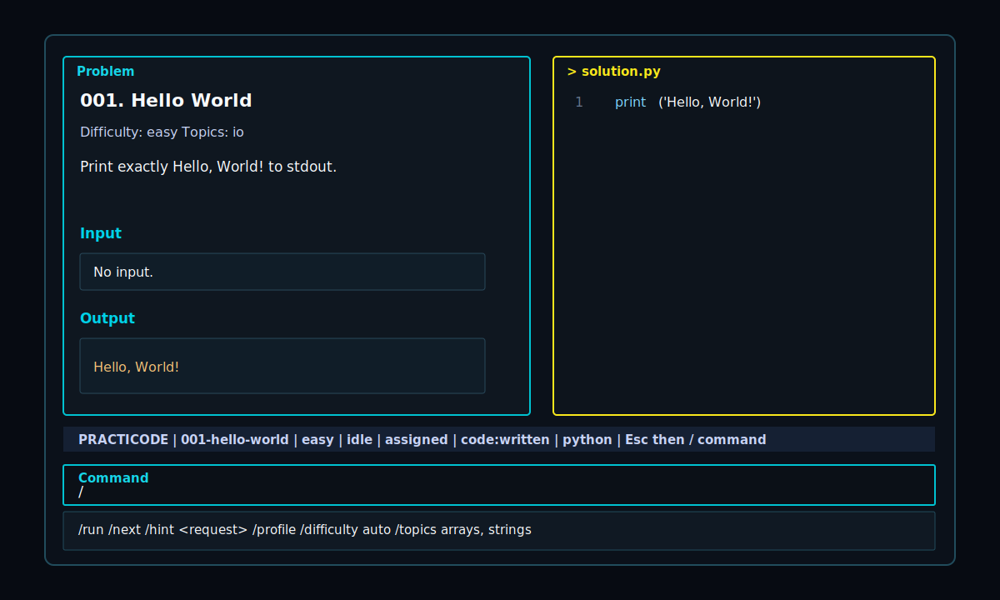

# practicode




Personal coding practice, right in your terminal.

`practicode` is a small Rust TUI for stdin/stdout practice: problem on the left, code on the right, judge loop in the same terminal.

## Start

### Prerequisites

- Node.js 18+ for npm installation.
- Rust and Cargo. The npm package builds the Rust binary during install, and also on first run if needed.
- A runtime for the language you practice in: Python, Node.js for TypeScript, JDK for Java, or Rust.

### npm

```bash
npm install -g practicode
practicode
```

### Cargo

```bash
cargo install practicode
practicode
```

### Local checkout

```bash
git clone https://github.com/baba9811/practicode.git
cd practicode
npm install
npm start
```

## Daily Loop

The code editor starts focused.

```text
write code
Esc, then /
choose /run
choose /next when it passes
```

Typing `/` outside the editor opens the command palette. Use `up/down` to move, `Enter` to run or complete the selected command, and `Esc` to cancel.

Submissions are saved as you type under `submissions/<problem-id>/solution.<ext>`.

## Commands

| Command | Action |
| --- | --- |
| `/run` | Judge the current submission |
| `/code` | Return to the code editor |
| `/next` | Open the next local problem, or ask AI to create one |
| `/next easy string problem` | Ask AI for a custom next problem |
| `/prev` | Go back through problem history |
| `/list` | Browse problems with `up/down` or `j/k`, open with `Enter` |
| `/open 2` | Open by number, id, or slug |
| `/giveup` | Show the reference answer |
| `/hint` | Ask the selected AI for a concise hint |
| `/hint explain my bug` | Ask the selected AI about the current problem and submission |
| `/provider codex` | Set AI provider and show local CLI/daemon status |
| `/model auto` | Use the provider default model for `/hint` and AI-backed `/next` |
| `/note prefer hashmap practice` | Append a standing note for future problem generation |
| `/notes` | Show your local next-problem notes |
| `/lang python` | Set code language: `python`, `ts`, `java`, `rust` |
| `/ui en` | Set UI language: `en`, `ko`, `ja`, `zh`, `es` |
| `/theme dark` | Set theme: `dark` or `light` |
| `/update` | Show update instructions when a newer version is available |
| `/exit` | Quit |

The default UI language is English. Switch it any time with `/ui ko`, `/ui ja`, `/ui zh`, or `/ui es`.

## AI Problems

`/next <request>` passes your request into the selected AI problem generator.

```text
/next a slightly harder string problem
/next hashmap practice, easy
/next sorting problem, no graph yet
```

Codex is the default provider:

```text
/provider codex
/model auto
```

Claude Code is also supported:

```text
/provider claude
/model sonnet
```

Generated problems and submissions stay local:

| Path | Purpose |
| --- | --- |
| `.practicode/problem_bank.json` | Local/custom/generated problems |
| `.practicode/problem_notes.md` | Optional personal problem-generation notes |
| `.practicode/problem-state.json` | Current problem, history, settings |
| `problems/` | Generated problem markdown/index files |
| `submissions/` | Your answer files |

Those paths are ignored by git, so your practice history stays yours.

## Update

The app checks for newer npm releases in the background and shows `/update` in the status line when one is available. Disable that check with `PRACTICODE_NO_UPDATE_CHECK=1`.

```bash
npm update -g practicode
cargo install --force practicode
```

## Safety

`/run` executes your local submission as a normal process. practicode runs it from `.practicode/build/<problem-id>/run`, but this is not an OS sandbox. Only run code you trust.

## Contributing

External contributions use the fork and pull request flow in [docs/CONTRIBUTING.md](docs/CONTRIBUTING.md).

Maintainer-only review and release notes live in [docs/MAINTAINING.md](docs/MAINTAINING.md).

## License

practicode is MIT licensed. Third-party dependency license notes are in [THIRD_PARTY_LICENSES.md](THIRD_PARTY_LICENSES.md).
